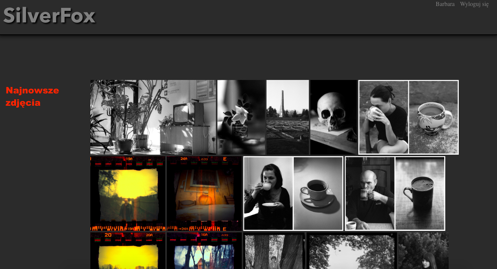
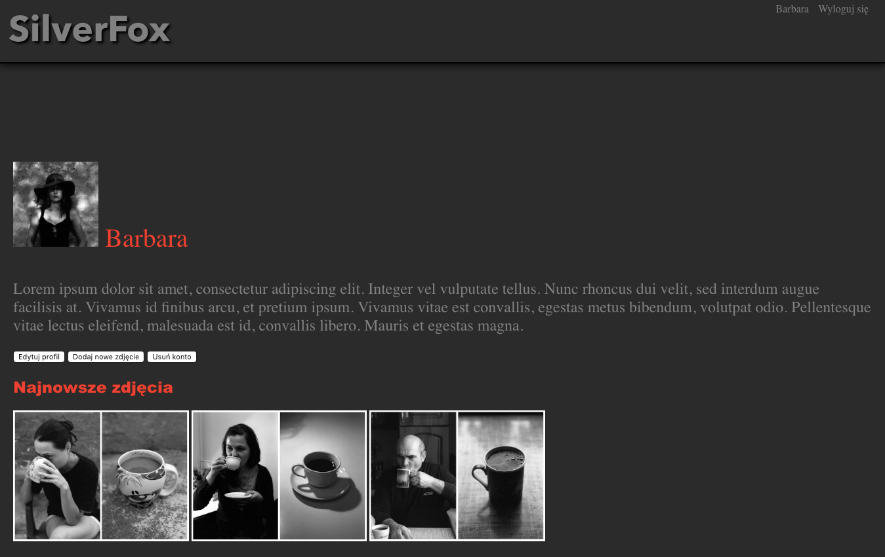
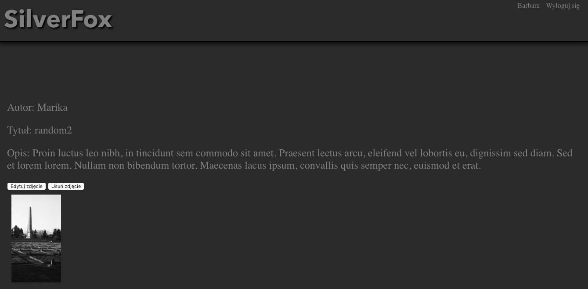
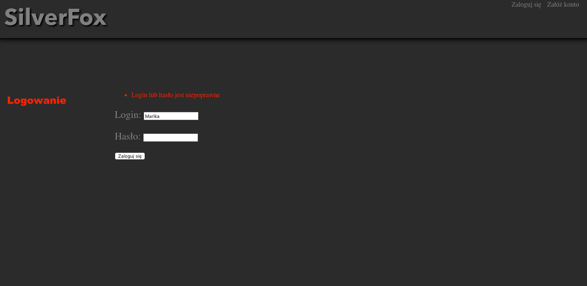
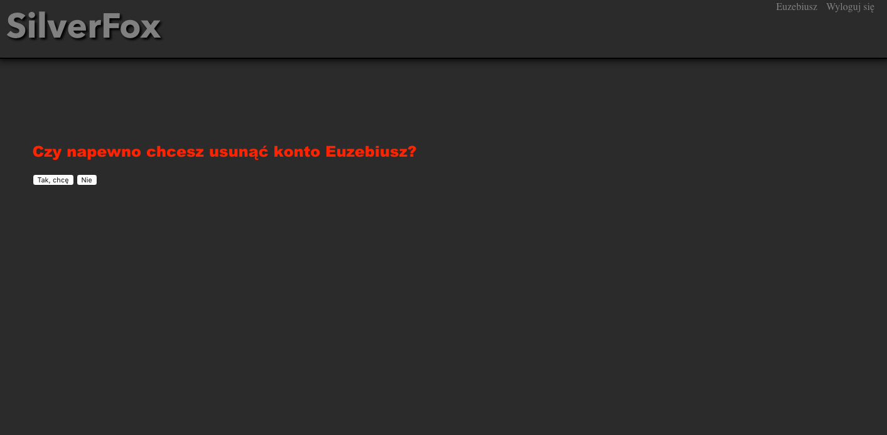

# SilverFox

## General info
My final project for Python course in Coders Lab. Traditional Photography Website.

Work in progress

## Functionality
User may create a new account on the website and update the account by adding a profile picture and description.
He may add photos to his gallery. Photos of all users are displayed on the main site (sorted by the time
and date added - newest first). He may login and logout whenever he wants to. If he is logged out he will not have
full access to the content on the site. The user may delete his photo and delete his account if he wants to.

## Technologies
Project is created with:
* Python
* Django
* HTML
* CSS

## Screenshots
Main site

User page

Photo page

Logging in

Removing account

